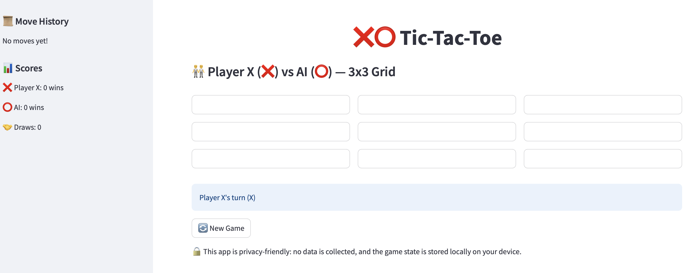

# Tic-Tac-Toe 

Welcome to my **Tic-Tac-Toe** game built with Streamlit! This project is an interactive web application where you can play Tic-Tac-Toe against another player or an AI opponent. I created this project to practice my Python and Streamlit skills while exploring game logic, AI, and user interface design. It’s a fun and simple game that shows how technology can bring classic games to life in a modern way!

## 🌟 Overview
This Tic-Tac-Toe game allows players to take turns on a customizable board, with options to play against another player or an AI powered by the minimax algorithm. The board size can be adjusted (from 3x3 to 6x6), and the game includes features like move history and score tracking. The app is built using Streamlit, making it easy to play in your browser.

I focused on making the game user-friendly and privacy-friendly, ensuring no data is collected and the game state is stored locally on your device.

## 📸 Demo


## 🎮 Features
- **Customizable Board Size**: Adjust the board size (from 3x3 to 6x6) using sliders.
- **Play Modes**:
  - Two-player mode: Players take turns as X (❌) and O (⭕) on the same device.
  - Single-player mode: Play against an AI opponent using the minimax algorithm for optimal moves.
- **Symbol Choice**: Player 1 chooses their symbol (X or O) at the start of the game.
- **Win Detection**: Detects a win when a player fills an entire row, column, or diagonal.
- **Draw Detection**: Detects when the board is full with no winner.
- **Interactive UI**:
  - Built with Streamlit for a smooth experience.
  - Move history displayed in the sidebar.
  - Score tracking for wins and draws over multiple games.
- **Reset Option**: Start a new game at any time with a button.
- **Status Updates**: Shows whose turn it is, announces the winner, or declares a draw with colorful messages.
- **Privacy-Friendly**: No data is collected; game state is stored locally on your device.

## 🛠️ Installation
To run this Tic-Tac-Toe game on your computer, follow these steps:

1. **Clone the Repository**:
   ```bash
   git clone https://github.com/JoNoubs/tic-tac-toe-streamlit.git
   cd tic-tac-toe-streamlit
   ```

2. **Set Up a Virtual Environment** (optional but recommended):
   ```bash
   python -m venv venv
   source venv/bin/activate  # On Windows: venv\Scripts\activate
   ```

3. **Install Dependencies**:
   Make sure you have Python installed (version 3.7 or higher). Then install the required libraries:
   ```bash
   pip install -r requirements.txt
   ```

4. **Run the App**:
   Start the Streamlit app with this command:
   ```bash
   streamlit run app.py
   ```
   This will open the game in your default web browser (usually at `http://localhost:8501`).

## 🎲 Usage
1. **Start the Game**:
   - Open the app in your browser after running the command above.
   - Enter the names for Player 1 (X) and Player 2 (O), or choose to play against the AI.
   - Adjust the board size using the sliders (e.g., 3x3, 4x4).
   - Click "Start New Game 🎉" to begin.

2. **Play the Game**:
   - Player 1 (❌) goes first. Click an empty cell to place your symbol.
   - In two-player mode, Player 2 (⭕) goes next. In single-player mode, the AI will automatically make a move.
   - Take turns until someone wins or the game ends in a draw.
   - The app will show whose turn it is at the bottom of the board.

3. **Check the Result**:
   - If a player wins, a green message will announce the winner (e.g., “🎉 Player X wins!”).
   - If the board is full with no winner, a yellow message will say “🤝 It’s a draw!”.

4. **View Move History and Scores**:
   - Check the sidebar to see the history of moves (e.g., “Move 1: Player X at (1,2)”).
   - The sidebar also shows the scores for X, O, and draws over multiple games.

5. **Start a New Game**:
   - Click the “🔄 New Game” button to return to the configuration screen and start a new game.

## 📂 Project Structure
```
tic-tac-toe-streamlit/
│
├── app.py              # Main application file with the game logic and Streamlit UI
├── requirements.txt    # List of dependencies required to run the app
├── README.md           # Project documentation (this file)
├── screenshot.png      # Screenshot of the app
├── tests/              # Directory for unit tests
│   └── test_game.py    # Unit tests for the game logic
└── .gitignore          # Git ignore file to exclude unnecessary files
```

## 🧪 Testing
The project includes unit tests to verify the game logic. To run the tests:

1. **Install Testing Dependencies**:
   ```bash
   pip install pytest
   ```

2. **Run the Tests**:
   ```bash
   pytest tests/test_game.py
   ```

The tests cover key functionalities like making moves, checking wins, and detecting draws.

## 🚀 Deployment
The app can be deployed to Streamlit Cloud for easy sharing:

1. **Push to GitHub**:
   - Ensure your repository is public or private (depending on your Streamlit Cloud plan).
   - Push the project to GitHub:
     ```bash
     git add .
     git commit -m "Initial commit"
     git push origin main
     ```

2. **Deploy on Streamlit Cloud**:
   - Go to [Streamlit Cloud](https://streamlit.io/cloud) and sign in with your GitHub account.
   - Click "New app" and select your `tic-tac-toe-streamlit` repository.
   - Set the main file to `app.py` and click "Deploy".
   - Once deployed, you’ll get a public URL to share your app (e.g., `https://your-app-name.streamlit.app`).

## 📫 Get in Touch
I’d love to hear your feedback or ideas for improving this project! Feel free to reach out:
- **LinkedIn**: [Johanna Grace Fokui Noubi](https://linkedin.com/in/johanna-grace-fokui-noubi-18006022b/)

If you’re interested in ethical tech, data science, or AI projects, let’s connect I’m always up for collaboration!
